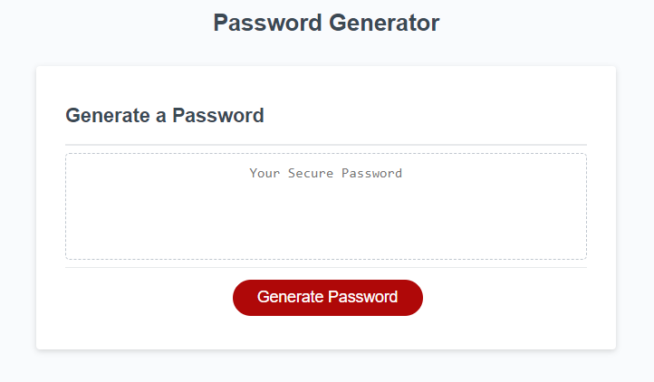
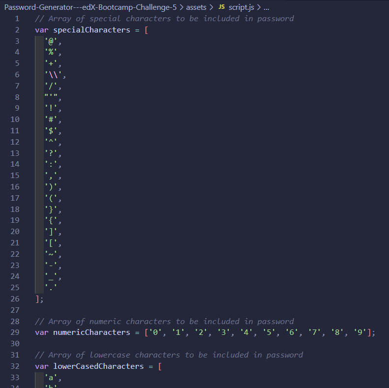
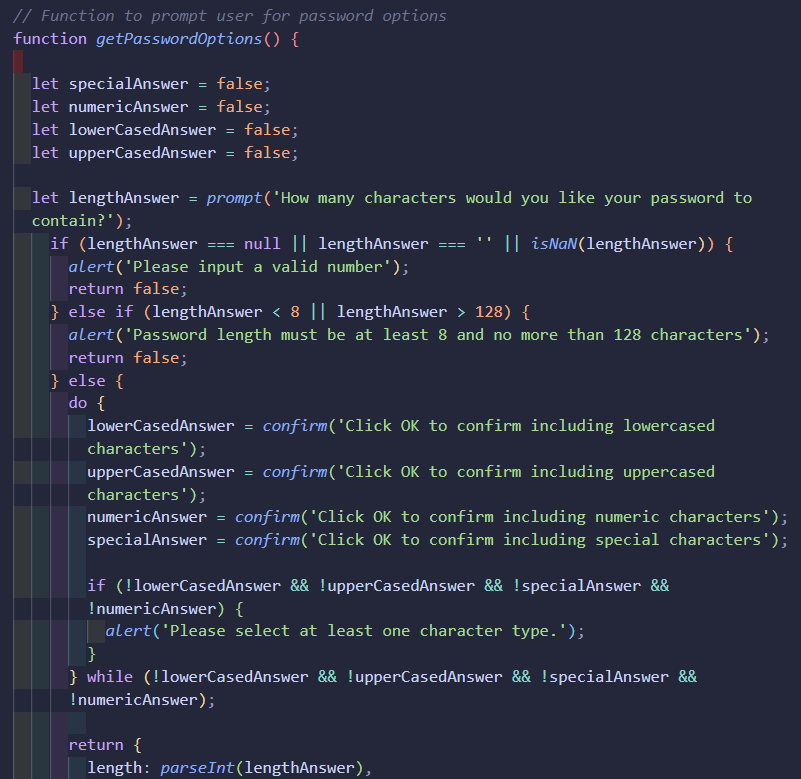
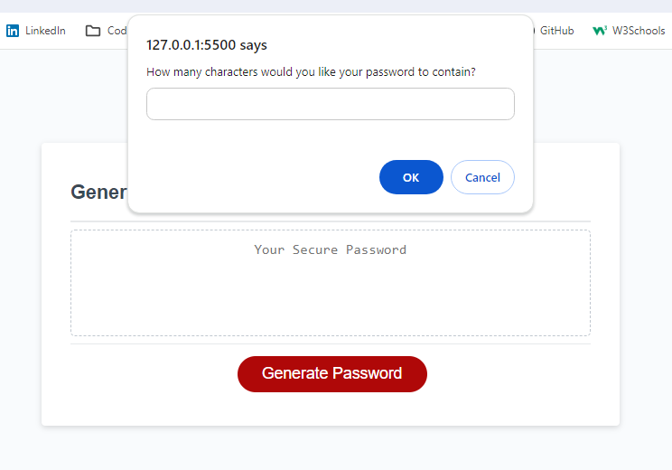

# Password Generator

This repository contains my answer to the Module 5 Challenge of the Web Development edX bootcamp: https://jpquental90.github.io/Password-Generator---edX-Bootcamp-Challenge-5/

## Description

My task was to create an application that an employee can use to generate a random password based on criteria they’ve selected by modifying the starter code that was provided. 

## Table of Contents

* [Installation](#installation)
* [Usage](#usage)
* [Credits](#credits)
* [License](#license)

## Installation

N/A

## Usage

#### This is a a picture of what the website looked like as presented by the starter code:

---

HTML, CSS and Javascript files were provided. The Javascript file contained some pre-written arrays and partially completed functions.

#### Some of the original content of the Javascript file:

---

HTML, CSS and JavaScript files were provided. The JavaScript file contained some pre-written arrays and partially completed functions.

#### Some of the code I added to the Javascript file:

---

After my modifications, the 'Generate Password' button works by providng the user with confirm and prompt messages allowing him to set the parameters for how his random password should be generated.

#### Screenshot of first message that appears upon clicking the button:

## Credits

Google was used to research how to best complete these functions. I also consulted some of the material from the edX classes.

## License

Licensed under the MIT license.